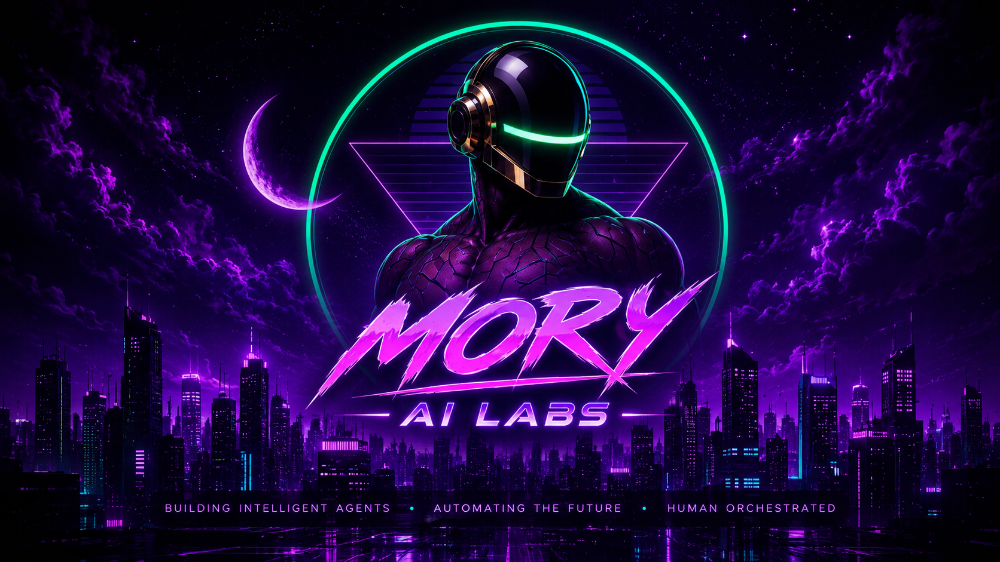

<p align="center">
  
</p>

<h1 align="center">Mory AI Labs</h1>

<p align="center">
  <strong>Studio d'Ingénierie & Venture Builder en Intelligence Artificielle</strong><br />
  Agents Autonomes · Modèles Prédictifs Métiers · Architectures RAG Souveraines
</p>

<p align="center">
  <a href="https://moryailabs.com">🌐 moryailabs.com</a>
</p>

---

## ⚡ Stack Technologique

- **Framework** : [Next.js 15 (App Router)](https://nextjs.org/) + [React 19](https://react.dev/)
- **Langage** : [TypeScript](https://www.typescriptlang.org/)
- **Styling & Design System** : [Tailwind CSS](https://tailwindcss.com/) + Néomorphisme & Verre Dépoli
- **Animations & Parallax** : [Framer Motion](https://www.framer.com/motion/)
- **Icônes & Typographie** : [Lucide React](https://lucide.dev/) + Integral CF & Inter
- **Formulaires & Edge API** : Edge Runtime + Web3Forms
- **Déploiement & CDN** : [Cloudflare Pages](https://pages.cloudflare.com/)

---

## 🚀 Démarrage Rapide

### 1. Installation des dépendances

```bash
npm install
```

### 2. Lancement du serveur de développement

```bash
npm run dev
```

Ouvrez [http://localhost:3000](http://localhost:3000) dans votre navigateur.

### 3. Build de production

```bash
npm run build
npm run start
```

---

## 📁 Architecture du Projet

```text
├── app/                  # Routes Next.js App Router
│   ├── about/            # Page À Propos
│   ├── services/         # Page Services & Offre IA
│   ├── contact/          # Page Contact & Cadrage
│   ├── api/contact/      # API Route Edge Runtime
│   ├── globals.css       # Design System & Thèmes Cyber-Emerald / Ultra-Violet
│   └── layout.tsx        # Root Layout & Theme Provider
├── components/           # Composants UI modulaires
│   ├── ParallaxBannerCard.tsx  # Carte bannière réutilisable avec Parallax & Néomorphisme
│   ├── Hero.tsx                # Hero Section holographique
│   ├── Navbar.tsx              # Navigation & Theme Switcher
│   ├── ProjectsSection.tsx     # Études de cas (GreenOps AI, etc.)
│   ├── ExpertiseSection.tsx    # Domaines d'expertise R&D
│   ├── ProcessSection.tsx      # Roadmap d'exécution & méthodologie
│   └── Footer.tsx              # Pied de page
├── public/               # Assets statiques, polices et images HD
└── assets/               # Images et sources graphiques
```

---

## 🌐 Déploiement

Le projet est configuré pour un déploiement continu et instantané sur **Cloudflare Pages** à chaque push sur la branche `main`.

---

<p align="center">
  <sub>© 2026 Mory AI Labs. Tous droits réservés.</sub>
</p>

